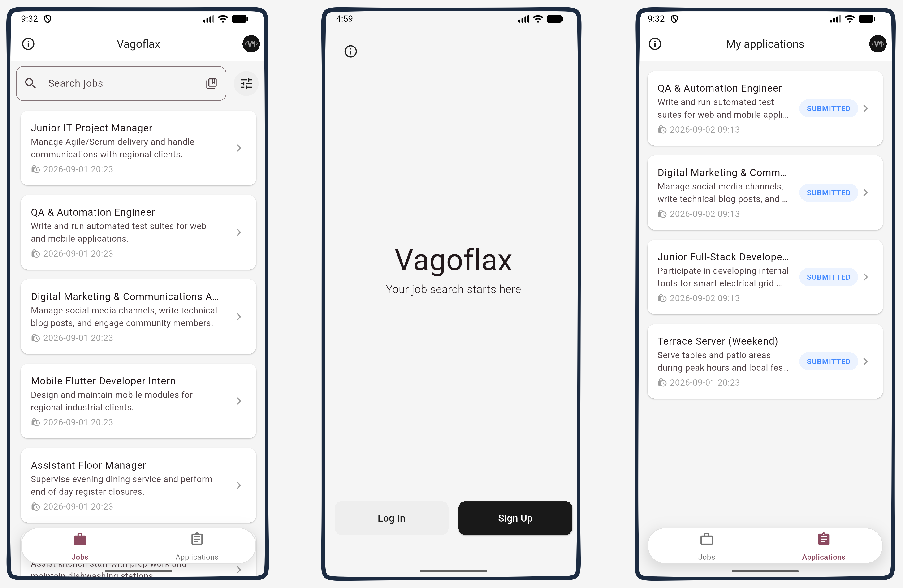

# vagoflax

App for HES-SO students to find a job easily. You can be either an employer or a student. Employers create job offers, where students can apply.

Made for the Mobile Development Summer School (208.1).

---

## Table of contents

1.  [App images](#app-images)
2.  [What the app does](#what-the-app-does)
3.  [Tech stack](#tech-stack)
4.  [Architecture overview](#architecture-overview)
5.  [Project structure](#project-structure)
6.  [How the layers work together](#how-the-layers-work-together)
7.  [State management with Provider](#state-management-with-provider)
8.  [Data models & Firestore structure](#data-models--firestore-structure)
9.  [Getting Started](#getting-started)
10. [Run tests](#run-tests)
11. [Repo policy](#repo-policy)
12. [Face recognition](#face-recognition)

---

## App images
<p align="center">
  
  <br>
  For more see <a href="assets/readme/usermanual.pdf">user manual</a>.
</p>

---

## What the app does
- **Authentication**: register and log in with email + password using **Firebase Auth**. Also link you face with your account in order to skip writing your email on login
- **Jobs**: employers create job listings with specific info
- **Applications**: students apply to those jobs, employers change the status (submitted, evaluated, accepted, rejected)
- **AI translation**: students can translate job offers using AI.
- **User reviews and ratings**: rating and review system from the users of the app

---

## Tech stack
| Concern              | Technology                          |
| -------------------- | ----------------------------------- |
| UI framework         | Flutter (Material)                  |
| State management     | `provider` (`ChangeNotifier`)       |
| Authentication       | `firebase_auth`                     |
| Database             | `cloud_firestore` (real-time)       |
| Image hosting        | Cloudinary (via `http` upload)      |
| Image picking        | `image_picker`                      |
| Transport info       | [Transport API](https://transport.opendata.ch/)|
| Translation AI       | [Ollama Gemma4](https://docs.ollama.com/api/introduction)      |
| Configuration        | `flutter_dotenv` (`.env` file)      |
| Tests                | `flutter_test` + hand-written fakes |

---

## Architecture overview

The app uses a **layered architecture**. Each layer has a single
responsibility and only talks to the layer directly below it. The UI never
talks to Firebase or Cloudinary directly.

```
┌───────────────────────────────────────┐
│  Views & Widgets (UI)                 │  what the user sees
│  login, applications, profile, etc.   │
└───────────────┬───────────────────────┘
                │ reads state / calls methods
┌───────────────▼───────────────────────────────┐
│  Providers (state management)                 │  app logic + UI state
│  AppState, JobProvider, UserProvider, ...     │
└───────────────┬───────────────────────────────┘
                │ depends on interfaces (not Firebase!)
┌───────────────▼────────────────────────────────┐
│  Repositories & Services (abstractions)        │  data access contracts
│  UserRepository, JobRepository,                │
│  ApplicationRepository                         │
└───────────────┬────────────────────────────────┘
                │ implemented by
┌───────────────▼────────────────────────────────┐
│  Concrete implementations                      │  the real integrations
│  FirestoreJobRepository, FirebaseAuthService,  │
│  FirestoreApplicationRepository                │
└───────────────┬────────────────────────────────┘
                │
┌───────────────▼───────────────────────────────────────┐
│  External services: Firebase, Cloudinary, Ollama LLM  │
└───────────────────────────────────────────────────────┘
```

---

## Project structure
```
vagoflax/
├── .github                  # CI/CD workflows
├── .env.example             # Template for local .env
├── Makefile                 # Shortcuts for flutter commands
├── NN_model                 # Python project: salary prediction model (training, results, visualisation)
├── README.md                # Technical guide
├── analysis_options.yaml    # Dart/Flutter linter rules
├── android                  # Android support
├── assets                   # Icon, ML models, README resources
├── firestore.rules          # Firestore security rules
├── ios                      # IOS support
├── lib/
│   ├── main.dart
│   ├── models
│   │   ├── connection.dart
│   │   ├── enum
│   │   │   ├── diplomas.dart
│   │   │   ├── favorite_choice.dart
│   │   │   ├── industry.dart
│   │   │   ├── languages.dart
│   │   │   ├── perks.dart
│   │   │   ├── role.dart
│   │   │   ├── status.dart
│   │   │   └── user_role.dart
│   │   ├── face_entry.dart
│   │   ├── history.dart
│   │   ├── job.dart
│   │   ├── job_application.dart
│   │   ├── job_filters.dart
│   │   ├── review.dart
│   │   ├── salary_prediction_model.dart
│   │   ├── section.dart
│   │   ├── translation.dart
│   │   └── user.dart
│   ├── providers
│   │   ├── application.dart
│   │   ├── auth.dart
│   │   ├── job.dart
│   │   └── user.dart
│   ├── repositories         # DB Interfaces
│   │   ├── application.dart
│   │   ├── firestore_application.dart
│   │   ├── firestore_job.dart
│   │   ├── firestore_user.dart
│   │   ├── job.dart
│   │   └── user.dart
│   ├── services             # Third-party APIs, computation
│   │   ├── address.dart
│   │   ├── cloudinary.dart
│   │   ├── face.dart
│   │   ├── ollama.dart
│   │   ├── salary_prediction.dart
│   │   ├── salary_preprocessor.dart
│   │   └── transport.dart
│   ├── utils                # Constants, themes, routes, utilities
│   │   ├── date.dart
│   │   ├── firebase_options.dart
│   │   ├── router.dart
│   │   └── theme.dart
│   ├── views                # Screens
│   │   ├── about_us.dart
│   │   ├── admin.dart
│   │   ├── auth
│   │   │   ├── auth_gate.dart
│   │   │   ├── login
│   │   │   │   └── login.dart
│   │   │   ├── signup
│   │   │   │   ├── emailpw.dart
│   │   │   │   ├── employer.dart
│   │   │   │   ├── face_recognition.dart
│   │   │   │   ├── student.dart
│   │   │   │   └── type.dart
│   │   │   └── welcome.dart
│   │   ├── employer
│   │   │   ├── add_job.dart
│   │   │   ├── job_applications.dart
│   │   │   └── job_offer.dart
│   │   ├── job
│   │   │   └── details.dart
│   │   ├── loading.dart
│   │   ├── profile.dart
│   │   └── student
│   │       ├── applications.dart
│   │       ├── gate.dart
│   │       └── search.dart
│   └── widgets              # Reusable UI components
│       ├── about_icon.dart
│       ├── app_icon.dart
│       ├── application_status_dialog.dart
│       ├── job
│       │   ├── application_student_item.dart
│       │   ├── employer_item.dart
│       │   ├── filter_drawer.dart
│       │   ├── form.dart
│       │   └── student_item.dart
│       ├── leave_review_sheet.dart
│       ├── logout_button.dart
│       ├── profile_button.dart
│       ├── profile_edit_form.dart
│       ├── search_filter.dart
│       ├── status_pill.dart
│       ├── user_item.dart
│       └── user_rating_badge.dart
├── linux                    # Linux desktop support
├── macos                    # macOS desktop support
├── mock_data                # Node project : script to clean and fille Firestore with mockdata
├── pubspec.yaml             # Dependencies
├── test                     # Unit & widget tests
├── web                      # Web support
└── windows                  # Windows desktop support
```

---

## How the layers work together

A concrete example: **browsing and applying to job offers in real time.**

1. `JobListScreen` (or `JobDetails`) reads `JobProvider` via `context.watch<JobProvider>()`.
2. `JobProvider` listens to `JobRepository.watchJobs()` (or fetches updates from Firestore).
3. `FirestoreJobRepository` queries the `jobs` collection via Firestore `.snapshots()`, mapping documents to `Job` models.
4. Whenever an employer creates a job, toggles visibility, or updates details in Firestore, the stream emits a new `List<Job>`.
5. `JobProvider` updates its internal state and calls `notifyListeners()`.
6. The UI rebuilds automatically to display the updated listings.

When an AI translation is requested or an application is submitted:
- The UI triggers `OllamaService.translate()` or `ApplicationProvider.applyToJob()`.
- The repository persists the new translation or application status in Firestore.
- Changes flow back through the providers, ensuring real-time consistency across all screens without manual state synchronization.

---

## State management with Provider

This project uses the **`provider`** package. The two key objects are
`ChangeNotifier`s registered in `main.dart`:

```dart
MultiProvider(
  providers: [
    ChangeNotifierProvider(
        create: (_) => UserProvider(FirestoreUserRepository()),
    ),
    ChangeNotifierProxyProvider<UserProvider, ApplicationState>(
        create: (context) =>
            ApplicationState(userProvider: context.read<UserProvider>()),
        update: (_, userProvider, previousState) =>
            (previousState ?? ApplicationState(userProvider: userProvider))
            ..updateUserProvider(userProvider),
    ),
    ChangeNotifierProvider(
        create: (_) => ApplicationProvider(FirestoreApplicationRepository()),
    ),
    ChangeNotifierProvider(
        create: (_) => JobProvider(
        FirestoreJobRepository(
            applicationRepository: FirestoreApplicationRepository(),
        ),
        ),
    ),
    ],
  ...
)
```

- **`ChangeNotifierProvider`** exposes a `ChangeNotifier` to the widget tree.
  When it calls `notifyListeners()`, listening widgets rebuild.
- **`ChangeNotifierProxyProvider`** is used because `ApplicationState` *depends on*
  `UserProvider`: it needs the current user's id for signup step 2.
- **Dependency injection**: the providers receive their data sources through
  their constructors (`UserProvider(FirestoreUserRepository())`,
  `ApplicationProvider(FirestoreApplicationRepository())`,
  `JobProvider(FirestoreJobRepository(...))`). This is what makes them testable.

In widgets you typically:

```dart
final jobs = context.watch<JobProvider>().jobs;   // rebuild on change
context.read<JobProvider>().deleteJob(jobId);     // call once, no rebuild
```
---

## Data models & Firestore structure

You can see all data models in the lib/models/ folder.

In Firestore we have three distinct collections:

### users
When signing up, row for user data is creating in `Authentication`. The row's ID is saved and is reused for the user collection in `Firestore`.

`users/$id`

Also, users can be either students, employers or `admin`. The Firestore fields change slightly depending on the role :

Role: `student`
```
firstName           string
lastName            string
email               string
role                UserRole        // enum
description         string
address             string
canton              string
profilePictureUrl   string?
skills              string[]
history             HistoryEntry[]  // see models
reviews             Review[]        // see models
savedSearches       string[]        // your bookmarked searches
favoriteJobs        string[]        // array of the ids of favorite jobs
createdAt           timestamp
```

Role: `employer`
```
companyName         string
email               string
role                UserRole        // enum
description         string
canton              string
address             string
profilePictureUrl   string?
companySize         int
reviews             Review[]        // see models
createdAt           timestamp
```

Role: `admin`
```
email       string
role        UserRole  // enum
createdAt   timestamp
```

### jobs
Jobs can only be posted by an employer.

`jobs/$jobId`

```
userUuid            string
title               string
description         string?
diplomas            Diplomas[]        // enum
contractTime        int?
minYearsExperience  int?
maxYearsExperience  int?
role                Role              // enum
industry            Industry          // enum
perks               Perks[]           // enum
languages           Languages[]       // enum
holidays            int?
maternityLeave      int?
paternityLeave      int?
workloadPercent     int?
salary              double?
predictedSalary     double?
visible             bool
translations        JobTranslation[]  // see models
createdAt           timestamp
```

### applications
Applications can only be submitted by a student and reviewed by the employer owning the related job.

`applications/$jobId_$studentId`

```
jobId               string
studentUuid         string
status              string        // e.g. 'submitted', 'reviewing', 'accepted', 'rejected'
lastUpdated         timestamp
createdAt           timestamp
```

Access is restricted by `firestore.rules`.

### Models
#### Review
Used in `users/$id` -> `reviews[]`
```
authorId            string
rating              double
comment             string
createdAt           timestamp
```

#### HistoryEntry
Used in `users/$id` -> `history[]`
```
title               string
organization        string
startDate           string
endDate             string?
```
#### JobTranslation
Used in `jobs/$id` -> `translations[]`
```
title               string
description         string
language            Languages         // enum
```

---

## Getting Started

### Prerequisites

- [Flutter SDK](https://docs.flutter.dev/get-started/install)
- An editor (VS Code or Android Studio) with the Flutter plugin
- A device or emulator
- A **Firebase** project
- A free **Cloudinary** account (for image uploads)
- A free **Ollama** account (for AI translation)

### Clone the repo

```bash
git clone https://github.com/val-mon/vagoflax
cd vagoflax
```

### Install dependencies

```bash
flutter pub get
```


### Firebase configuration

- Install [Firebase CLI](https://firebase.google.com/docs/cli) on your computer
- Log in to your Google account via the terminal:
```bash
firebase login
```
- Install the Flutterfire CLI
```bash
dart pub global activate flutterfire_cli
```
- Generate the needed files for **android, ios, windows and macos** :
```bash
flutterfire configure
```

Then, in the Firebase console:

- enable **Authentication → Email/Password**
- create a **Cloud Firestore** database
- deploy the security rules:

  ```bash
  firebase deploy --only firestore:rules
  ```

### Environment variables configuration

Create a `.env` file at the root of your project following the structure of `.env.example`.

```
CLOUDINARY_APIKEY=your_cloudinary_api_key
CLOUDINARY_APISECRET=your_cloudinary_api_secret
CLOUDINARY_CLOUDNAME=cloudinary_cloud_name
OLLAMA_APIKEY=ollama_api_key
```

For the translation to work, you must put your Ollama API key in the `.env` file. The app does requests to the official Ollama servers and doesn't run the LLM locally.

### Run the app

```bash
make run
```

---

## Run tests

```bash
flutter test
```

---

## Database mock data

You can setup your Firebase with mock data by using the `make mock_data` script. It requires the `serviceAccountKey.json` that you can acquire in the Firebase console.

---

## Repo policy

### Branches
` main ` : The main branch containing the releases\
` dev (default) ` : The development branch that will be merge into main when a release is created \


#### Working branches
One branch per task that will be merge into dev when the task is over
- `feat/...` - new feature
- `fix/...` - fix a bug
- `chore/...` - config, setup, ...
- `test/...` - new tests
- `docs/...` - documentation
- `refactor/...` - refactoring the code

### Commits
Commit format: 
``` md
TYPE (SCOPE): Description

example:
feat (HomePage): Add login button
```

#### Types
- `feat:` - new feature
- `fix:` - fix a bug
- `chore:` - config, setup, ...
- `test:` - new test
- `docs:` - documentation
- `refactor:` - refactoring the code

## Face Recognition

### When it's used

- **Sign up**: the user takes a photo, its face signature is stored with their account.
- **Log in**: an optional "Find my account with my face" button takes a photo, matches it against known signatures, and pre-fills the email field. The password is still required.

### Setup

1. Add the model to `assets/model/mobile_face_net.tflite`.
2. Dependencies: `google_mlkit_face_detection`, `flutter_litert`, `image`.
3. Camera and gallery permissions must be granted (handled via `image_picker`).

### Pipeline

1. **Detect** the face in the photo with ML Kit (fails if 0 or 2+ faces).
2. **Preprocess**: crop around the face, fix rotation using the roll angle, resize to 112×112.
3. **Embed**: run the crop through MobileFaceNet (TFLite) → 192-value vector.
4. **Normalize**: L2-normalize the vector so distances are comparable.
5. **Compare** (login only): compute the Euclidean distance to every known signature; the closest one under a threshold (`0.95`) is considered a match.
